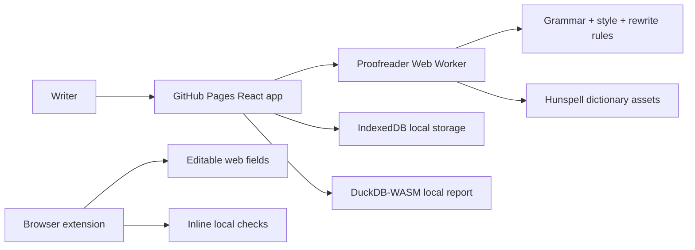

# Local Proofreader


Live site: https://baditaflorin.github.io/local-proofreader/

Repository: https://github.com/baditaflorin/local-proofreader

Support: https://www.paypal.com/paypalme/florinbadita

Local Proofreader is a local-first grammar, spelling, style, and rewrite assistant for people who want Grammarly-like feedback without sending drafts to a server. It runs as a GitHub Pages app, supports file import, session export, local restore, and a lightweight browser-extension wrapper, and keeps draft text inside the browser.


## Quickstart

```sh
npm install
make install-hooks
make build
make smoke
make pages-preview
```

## What Works

- Local grammar checks inspired by LanguageTool rules.
- Hunspell-compatible spelling with `nspell` and packaged English dictionaries.
- Vale-style editorial rules for jargon, hedging, passive voice, and long sentences.
- Deterministic local rewrite suggestions with no hosted LLM call.
- File import for `.txt`, `.md`, `.html`, multi-file batches, clipboard reads, and versioned session `.json` restores.
- Export of corrected text, analysis JSON, session JSON, and shareable URL hashes for small drafts.
- Local draft restore, persisted settings, and local custom-dictionary management.
- DuckDB-WASM compact local history report from IndexedDB analysis history.
- Manifest V3 browser extension wrapper for lightweight inline checks on editable fields.
- PWA build, local hooks, unit tests, integration target, and Playwright smoke test.

## Limitations

- Remote URL import is not built in Mode A because GitHub Pages cannot fetch most external pages through browser CORS.
- Shareable URL hashes are intentionally limited to smaller sessions. Large drafts should use session JSON export instead.
- The extension uses a lightweight shared inline ruleset, not the full worker-based app surface.

## Architecture



Architecture docs: https://github.com/baditaflorin/local-proofreader/blob/main/docs/architecture.md

ADRs: https://github.com/baditaflorin/local-proofreader/tree/main/docs/adr

Deploy guide: https://github.com/baditaflorin/local-proofreader/blob/main/docs/deploy.md

Privacy: https://github.com/baditaflorin/local-proofreader/blob/main/docs/privacy.md

## Browser Extension

```sh
npm run build:extension
```

Then load `extension/` as an unpacked extension. The generated content script lives in `extension/dist/`, which is intentionally not committed. The extension reuses the shared lightweight inline rules, but it does not ship the full app worker, report, or session-management UI.

## Pages Publishing

GitHub Pages serves `main` branch `/docs`. `make build` writes a Pages-ready app into `docs/` and keeps ADR Markdown files in place.

The live app displays the version and commit from `/version.json`.
