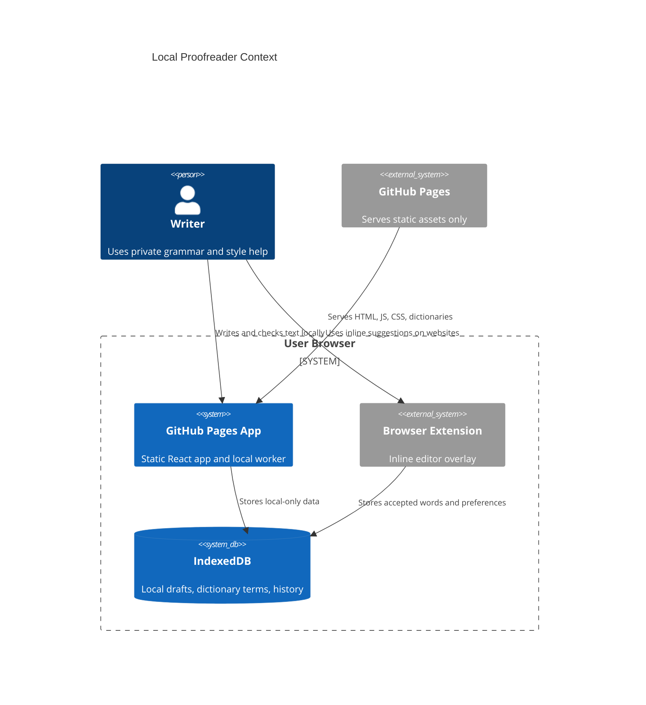
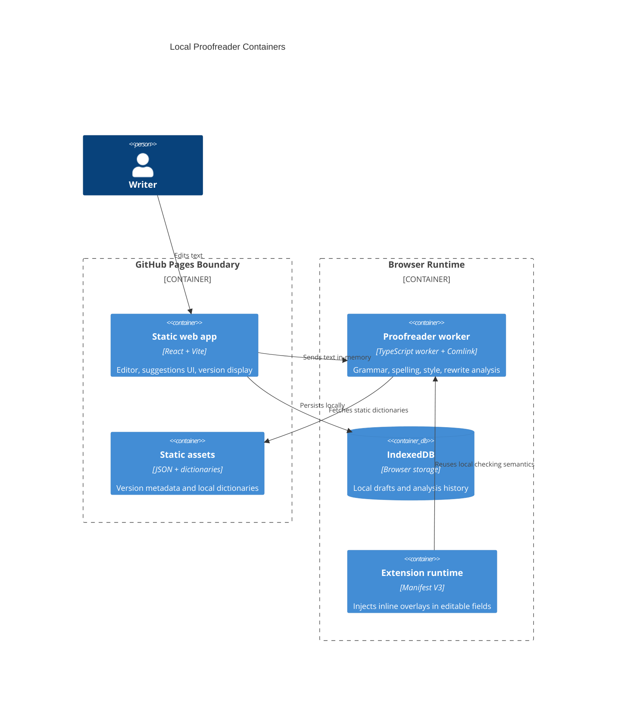

# Architecture

Live site: https://baditaflorin.github.io/local-proofreader/

Repository: https://github.com/baditaflorin/local-proofreader

## Context

## Containers

## Boundaries

User text never crosses the browser boundary. GitHub Pages serves application files only and receives normal static-asset requests. The app includes visible links to https://github.com/baditaflorin/local-proofreader and https://www.paypal.com/paypalme/florinbadita.
